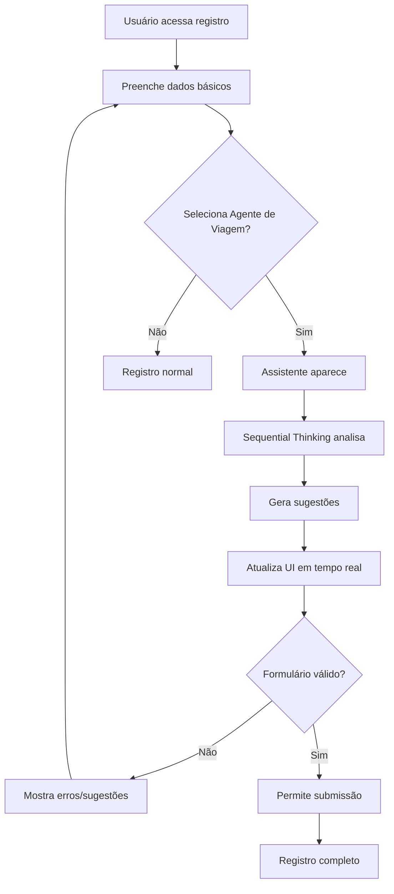

# 🧠 Sistema de Registro Inteligente com Sequential Thinking

## Visão Geral

Este sistema utiliza **Sequential Thinking** para tornar o processo de registro de agentes de viagem mais inteligente, intuitivo e livre de erros. O sistema analisa o contexto do formulário em tempo real e fornece orientações personalizadas.

## 🚀 Funcionalidades Implementadas

### 1. **Assistente de Registro Inteligente** (`registrationAssistant.js`)
- **Análise contextual** do formulário usando sequential thinking
- **Validações específicas** para agentes de viagem
- **Sugestões personalizadas** baseadas no tipo de perfil
- **Score de completude** do registro

### 2. **Componente Helper Visual** (`TravelAgentRegistrationHelper.vue`)
- **Interface intuitiva** que aparece quando "Agente de Viagem" é selecionado
- **Barra de progresso** showing completion percentage
- **Validações em tempo real** com feedback visual
- **Dicas profissionais** específicas para agentes de viagem

### 3. **Integração no Registro** (`Register.vue`)
- **Detecção automática** quando agente de viagem é selecionado
- **Análise contínua** do formulário
- **Prevenção de erros** antes da submissão

## 🎯 Como Funciona o Sequential Thinking

### Processo de Análise:

1. **Contexto**: O sistema identifica que o usuário quer se registrar como agente de viagem
2. **Análise Sequencial**: 
   - Verifica se o nome está completo (importante para credibilidade profissional)
   - Analisa se o email parece profissional
   - Valida a força da senha
   - Verifica consistência entre senha e confirmação
3. **Geração de Sugestões**:
   - Recomenda nome completo para credibilidade
   - Sugere email profissional se necessário
   - Dá dicas específicas para agentes de viagem
4. **Score de Qualidade**: Calcula um score baseado na completude e qualidade dos dados

### Exemplo de Pensamento Sequencial:

```
Thought 1: "Usuário preencheu o nome. Verificando se parece completo..."
Thought 2: "Nome tem apenas uma palavra, pode não parecer profissional"
Thought 3: "Email preenchido. Verificando se é profissional..."
Thought 4: "Email é Gmail, pode sugerir email profissional"
Thought 5: "Verificando força da senha..."
Thought 6: "Analisando perfil como agente de viagem... Este é um perfil profissional."
```

## 📋 Como Usar

### 1. Registro Normal
- Acesse `/auth/register`
- Preencha os dados básicos
- Selecione "Agente de Viagem" no tipo de perfil
- **O assistente aparecerá automaticamente!**

### 2. Teste/Demonstração
- Use o componente `RegistrationDemo.vue` para ver o sistema funcionando
- Experimente diferentes combinações de dados
- Observe como as sugestões mudam baseadas no input

## 🔧 Arquivos Criados/Modificados

### Novos Arquivos:
- `src/services/registrationAssistant.js` - Core logic with sequential thinking
- `src/components/utils/TravelAgentRegistrationHelper.vue` - Helper UI component
- `src/components/utils/RegistrationDemo.vue` - Demonstration component

### Arquivos Modificados:
- `src/views/Auth/Register.vue` - Integrated intelligent assistant

## 💡 Exemplos de Sugestões Geradas

### ⚠️ **Warnings (Avisos)**
- "Como agente de viagem, recomendamos usar seu nome completo para maior credibilidade profissional."

### 💡 **Tips (Dicas)**
- "Considera usar um email profissional com seu nome para transmitir mais credibilidade aos clientes."

### ℹ️ **Info (Informações)**
- "✈️ Como agente de viagem, você terá acesso a ferramentas exclusivas para conectar-se com representantes e fornecedores."

### ✅ **Success (Sucesso)**
- "🎉 Perfil está bem estruturado! Após o registro, não esqueça de completar seu perfil profissional com CPF, WhatsApp e portfólio."

## 🎨 Interface Visual

O helper visual inclui:
- **Header com ícone de avião** e título personalizado
- **Barra de progresso animada** showing completion percentage
- **Seções organizadas** para validações e sugestões
- **Ícones contextuais** para diferentes tipos de mensagem
- **Design responsivo** que funciona em mobile e desktop

## 🔄 Fluxo de Trabalho



## 🚀 Próximos Passos

### Melhorias Futuras:
1. **Integração com APIs externas** para validação de CPF/CNPJ
2. **Machine Learning** para melhorar sugestões baseadas em histórico
3. **Multilínguas** support for international agents
4. **Analytics** para track completion rates
5. **A/B Testing** para otimizar sugestões

### Extensibilidade:
- Adicionar outros tipos de perfil (Representante, Cliente)
- Implementar análise mais avançada com IA
- Criar dashboards para administrators

## 🧪 Como Testar

### Teste Básico:
1. Vá para `/auth/register`
2. Selecione "Agente de Viagem"
3. Preencha os campos gradualmente
4. Observe as sugestões aparecerem

### Teste de Demonstração:
1. Use o componente `RegistrationDemo.vue`
2. Experimente diferentes scenarios:
   - Nome incompleto
   - Email não-profissional
   - Senha fraca
   - Campos vazios

### Casos de Teste:
- ✅ Nome completo: "João Silva" → Score increase
- ⚠️ Nome incompleto: "João" → Warning suggestion
- ✅ Email profissional: "joao@empresa.com" → Good score
- 💡 Email pessoal: "joao@gmail.com" → Tip suggestion
- ❌ Senha fraca: "123" → Error validation
- ✅ Senha forte: "MinhaSenh@123" → Score increase

## 📞 Suporte

Se encontrar algum problema ou tiver sugestões:
1. Verifique o console do browser para errors
2. Teste com diferentes combinações de dados
3. Confira se todos os arquivos foram criados corretamente

## 🏆 Benefícios

### Para o Usuário:
- **Menos erros** durante o registro
- **Orientação clara** sobre como preencher
- **Feedback instantâneo** sobre a qualidade dos dados
- **Experiência profissional** adequada ao perfil

### Para o Sistema:
- **Dados mais consistentes** no banco
- **Menos support tickets** relacionados a registro
- **Maior taxa de conclusão** do registro
- **Melhor qualidade** dos perfis criados

---

**Desenvolvido com Sequential Thinking para uma experiência de registro mais inteligente! 🧠✈️** 